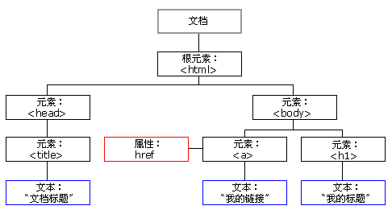

# HTML知识
## 简介
- HTML 标签： 
- HTML 文档： 网页

## 基础
- HTML标题： `<h1> - <h6>`
- HTML段落： `<p>`
- HTML链接： `<a href=""> `
- HTML图像： ``

## 元素
是指到开始标签到结束标签的所有代码。
HTML元素语法：
- HTML 元素以开始标签起始
- HTML 元素以结束标签终止
- 元素的内容是开始标签与结束标签之间的内容
- 某些 HTML 元素具有空内容（empty content）
- 空元素在开始标签中进行关闭（以开始标签的结束而结束）
- 大多数 HTML 元素可拥有属性
- HTML元素可以嵌套

元素：
- `<body> `元素
- `<html> `元素
- `<p> `元素

注意： 
- 空的HTML元素可以在开始标签结束
- HTML标签对大小写不敏感

## 属性
- 为HTML元素提供更多的信息.
- 表现方式为`key=“value”`, 并在开始标签中规定。
- 在某些个别的情况下，比如属性值本身就含有双引号，那么您必须使用单引号

e.g:
```
<a href="http://www.w3school.com.cn">This is a link</a>
<text name='Bill "HelloWorld" Gates'> test </text>
```

## HTML注释
```
<!-- 在此处写注释 -->
```

## CSS样式
外部样式表e.g:
```
<head>
<link rel="stylesheet" type="text/css" href="mystyle.css">
<head>
```

## 块元素与内联元素
- 大多数HTML元素被称为块级元素（block level element）或者内联元素（inline element）
- 块级元素在显示的时候会以新行的方式来显示。

### div
`<div>`  是一个块级元素（浏览器通常会在 div 元素前后放置一个换行符），没有其他含义。

#### 用法
- div 将文档分为独立的， 不同的部分（division/section/节）。
- 意味着自动开始一个新行。
- 可以通过class或者id应用额外的样式。

#### demo
```
<body>

 <h1>NEWS WEBSITE</h1>
  <p>some text. some text. some text...</p>
  ...

 <div class="news">
  <h2>News headline 1</h2>
  <p>some text. some text. some text...</p>
  ...
 </div>

 <div class="news">
  <h2>News headline 2</h2>
  <p>some text. some text. some text...</p>
  ...
 </div>

 ...
</body>
```

### span元素
定义 span，用来组合文档中的行内元素。

# Javascript
- HTML 定义网页的内容
- CSS 规定网页的布局
- JavaScript 对网页行为进行编程

# HTML DOM
- DOM 是 W3C（万维网联盟）的标准。
- DOM 定义了访问 HTML 和 XML 文档的标准, 是中立于平台和语言的接口，它允许程序和脚本动态地访问和更新文档的内容、结构和样式。
- Document Object Model

HTML DOM 树


## DOM 节点
在 HTML DOM 中，所有事物都是节点。DOM 是被视为节点树的 HTML。

根据 W3C 的 HTML DOM 标准，HTML 文档中的所有内容都是节点：

- 整个文档是一个文档节点
- 每个 HTML 元素是元素节点
- HTML 元素内的文本是文本节点
- 每个 HTML 属性是属性节点
- 注释是注释节点

## link
https://www.w3school.com.cn/h.asp

# Vue入门

